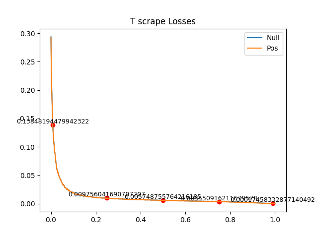

[](https://opensource.org/license/mit)

# R2IR-R2ID: Resolution Invariant Image Resampler - Resolution Invariant Image Diffuser

R2IR (Resolution Invariant Image Resampler) and R2ID (Resolution Invariant Image Diffuser) are a novel pair of
architectures for diffusion, designed to address key limitations in traditional models such as UNet and DiT. They treat
images as continuous functions rather than fixed pixel grids, enabling robust generalization to arbitrary resolutions
and aspect ratios without artifacts like doubling or squishing. The model learns an underlying data function, ignoring
pixel density, through dual positional embeddings and Gaussian coordinate jitter. The architectures employ Linear
Attention so that they're fast and practical to use even at massive resolutions beyond 1MP.

The code was developed and tested in PyCharm, Python 3.14, on a consumer RTX 5080. For MNIST, R2IR took 40m to train,
and R2ID took 30m to train. Both models consumed under 6GiB during the training process, using a batch size of 100. R2IR
has 1,884,161 parameters and R2ID has 10,385,920 parameters. Diffusion, even on massive latents such as 256x256 (
resulting in a 2048x2048 image for MNIST, but realistically will be 4096x4096 for proper size models) is fast, at about
4.2 iterations per second. Diffusing on small latents such as 10x10 (sufficient for MNIST), results in speeds such as 70
iterations per second. The models were trained without any image augmentation, yet successfully show to generalize to
resolutions way beyond and similarly so to aspect ratios.

With this architecture, I hope that R2IR and R2ID prove to powerful, competent, yet lightweight and fast diffusion
models: fast to train and fast to run.

## Architecture Overview

See `modules/r2ir_r2id.py` for the full implementation of R2IR and R2ID.

R2IR-R2ID is a two-stage resolution invariant diffusion system. R2IR performs the role of an autoencoder (somewhat),
while R2ID is the actual diffusion model. The training pipeline subsequently doesn't differ from any latent diffusion
model:

1. Train R2IR to encode an image into a latent and decode it, minimizing the reconstruction loss
2. Train R2ID to predict epsilon noise in latent space

And subsequently, the inference pipeline also isn't any different to any latent diffusion model:

1. Create a latent filled with gaussian noise
2. Predict epsilon noise and subtract it
3. Decode the latent with R2IR

However, R2IR and R2ID have a couple key differences to traditional latent diffusion models which sets them apart and
allows them to be resolution invariant and aspect ratio robust.

### 1. Dual Coordinate Relative Positioning System and Coordinate Jittering

Both R2IR and R2ID work on a dual coordinate relative positioning system for each pixel latent pixel. This allows the
model
to know where the pixels are and understand spatial semantics.

For each pixel in the image (latent or raw), we can create two X/Y coordinates:

1. A coordinate of how far the pixel is relative to the edge of the image: make +-0.5 the edges; thus a relative system
2. A coordinate of how far the pixel is if it were rendered on a screen: inscribe the image into a square and make the
   square's edges +-0.5; thus an absolute system

During training, these two values are jittered by adding gaussian noise with a stdev of half a pixel's height / width,
thus changing the task from a fixed grid of pixels to something more along the lines of "here's a set of samples from a
continuous field whose colors and coordinates we know", with the underlying field being effectively a collection of
gaussian splats centered at the true pixel's coordinate. This makes the models resolution invariant.

We then pass these coordinates through a fourier series akin to RoPE, except that the frequencies are ever-increasing
rather than ever-decreasing. This is because the largest values will always ever be +-0.5; we need higher and higher
frequencies to distinguish closer and closer packed pixels. Normalize the values within each group. These coordinates
are then directly concatenated atop of the color channels, and afterwards expanded by a 1x1 convolution kernel to
whatever necessary dimension.

### 2. R2ID - Resolution Invariant Image Diffuser

From a narrative standpoint, it makes more sense to look at R2ID first to understand the pitfalls and subsequent
necessity of R2IR.

R2ID is a general diffusion model, tasked with predicting the epsilon noise for some image. The image can of course
be a latent image. Internally, it works in a similar way to LLM transformer blocks, but adjusted for images.

There's two types of blocks: "encoder", which is tasked with just figuring out the image composition and subsequently
doesn't have text conditioning; and "decoder" which is identical to the encoder, but with the addition of the text
conditioning. As input, R2ID receives an image, adds to it the coordinate system and expands out to the number of
working channels, then passes the image through encoder blocks. Then, for each text conditioning that it received, it
passes the "encoded" latent through the decoder blocks, and then passes through a 1x1 convolution kernel to return back
the predicted epsilon noise. The decoder block works as follows:

1. Apply AdaLN for time conditioning
2. Residual add full self attention (linear attention) with the pixels for the QKV
3. Apply AdaLN for time conditioning
4. Residual add cross attention (linear attention) with the pixels for Q and the text for KV
5. Apply AdaLN for time conditioning
6. Pass through an FFN, the final output is the residual addition of all 6 steps and the unmodified tensor received on
   input

Key note is that AdaLN works on GRN normalization, the pixels are the combination of the coordinates and colors as
explained in the previous section, and all kinds of attention work on linear attention for speed. This is done with the
consideration and intent of diffusing on massive latents. With the way that R2IR works, it's projected that for a full
model, it will be able to compress the height and width by 16x, and the less pixels we have in the latent, the faster it
will be. Thus, 256x256 will map to a 4096x4096 image. 256x256=65536, which is impossibly big for non-linear attention.
We need methods of drastically cutting down the total number of pixels.

### 3. R2IR - Resolution Invariant Image Resampler

The main issue with R2ID is that it heavily relies on attention, and even though linear attention is used, it will still
be slow in pixel space. We need a way to cut down the number of pixels but expand the number of channels, and that's the
task of R2IR.

R2IR is NOT an autoencoder, and does not have any convolution kernels (they're not resolution invariant). Instead, R2IR
relies on the same dual coordinate positioning system to selectively figure out what information to put into the latent
and what information to pull out of the latent. It works on cross attention (linear attention for speed) for this
selective process.

For encoding, it turns the image into a latent (can be a fixed rescale size, or into any specific height and width,
with the way the relative system works, it really doesn't matter what compression ratio we use). For decoding, it turns
a latent into an image (can be a fixed rescale size, or into any specific height and width).

Regardless of encoding or decoding, the principle is identical. We have an arbitrary amount of blocks that do the
following:

1. Ask for an "image" that's assumed to store color information between [-1, 1], concatenate to it the coordinates and
   expand via a 1x1 convolution kernel to whatever working dimension
2. Create an "empty" tensor of just the coordinate system of the necessary size into which we want the information to
   flow (the latent for encoding, and pixel-space for decoding). Expand to the working dimension via a 1x1 convolution
   kernel
3. Make the tensor that we want to accumulate the information the Q, and the tensor to pass the information the KV

This is repeated for whatever amount of "encoder" blocks for turning an image into a latent, and "decoder" blocks for
turning a latent into an image. They use residual addition akin to the blocks in R2ID. Early blocks hence capture
position-only information, while later blocks can rely on both position and color for information transfer. We then use
a 1x1 convolution kernel followed by `nn.Tanh()` to make the output bound by (-1, 1). Yes, this also means that the
latent space is literal colors too.

## Installation and Inference

The code for the architecture and training is hosted on GitHub, while the models are hosted on Hugging Face.

GitHub: https://github.com/Yegor-men/resolution-invariant-image-diffuser
Hugging Face: https://huggingface.co/yegor-men/resolution-invariant-image-diffuser

To install, please clone the repository and install the necessary requirements.

```bash
git clone https://github.com/Yegor-men/resolution-invariant-image-diffuser.git
cd resolution-invariant-image-diffuser
pip install -r requirements.txt
```

Currently, R2IR-R2ID only have a working `MNIST` examples section, more sections to come with more training.

### MNIST

To make sure you have all the necessary models installed for MNIST, please run `MNIST/download_models.py`. It will
automatically download the necessary `.safetensors` models from Hugging Face into `MNIST/models/`, and you will be ready
to diffuse.

- `train_r2ir.py`: trains R2IR and saves intermittent checkpoints into `MNIST/models/`
- `inference_r2ir.py`: given that the according R2IR model is saved in `MNIST/models/`, inference on the R2IR model
- `train_r2id.py`: given that an R2IR model exists in `MNIST/models/`, trains an R2ID model and a simple text encoder
  model and saves intermittent checkpoints into `MNIST/models/`
- `inference_r2id.py`: given that an R2IR, R2ID and text encoder exist in `MNIST/models/`, diffuses a bunch of sample
  grid of digits and saves them to `MNIST/media`
- `t_scraping.py`: given that an R2IR, R2ID and text encoder exist in `MNIST/models/`, scrapes through t (alpha bar) and
  records the loss for each stage in the diffusion process

## Results

Some sample diffusions and latent representations are found in `media/`. If you want the full scrape of latent
resolutions the resolutions into which the latent is resampled, check the releases page.

https://github.com/Yegor-men/resolution-invariant-image-diffuser/releases/tag/media-26-03-01 contains a zipped
`media.zip` which holds 240 or so images of all possible combinations.

Here is a picture of the MSE loss across t. Low t = high SNR, high t = low SNR.


For those lazy, here are some of the diffused examples.

Diffused on 10x10 latent, resampled into 10x10


Diffused on 10x10 latent, resampled into 16x16


Diffused on 10x10 latent, resampled into 64x64


Diffused on 10x10 latent, resampled into 40x24 (5:2 aspect ratio)


## License

This project is licensed under the MIT License, see `LICENSE` for details.

## Roadmap

While R2IR and R2ID are completed in terms of architecture, there's still a couple of things left to do:

- Train on a high resolution dataset
- Make R2IR-R2ID work with ComfyUI

## Acknowledgments

Inspired by discussions on r/MachineLearning, mainly suggestions left in the comments of the Reddit posts. Thanks to
Google, OpenAI and xAI for developing their respective LLM chatbots that helped me with research, ideas, explanations
and analyses of diffusion architectures and suggestions as this project began deep in the Dunning-Kruger valley.